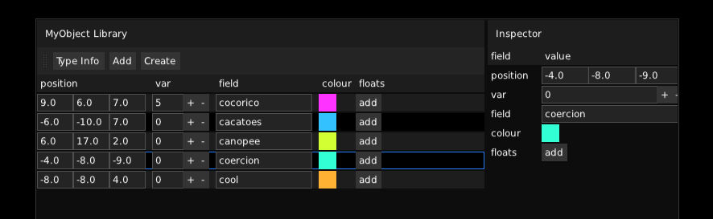

# tutorial
everything starts with your code : the domain specific problem you want to solve, the application *business logic*.  
in mud we start here, and not in intricate hierarchies of classes and components to inherit. as such mud is more alike to a programming idiom than a framework.  

for this tutorial, we are gonna create a simple module with one class, and from that guide you through the following steps :
- [precompile](#precompiling) the reflection of your module
- [run](#bootstrap) a simple application
- [browse](#inspect-modules-and-types) your module meta data in-app
- create some objects and [inspect](#inspect-objects) them in-app
- draw a simple [user interface](#ui)
- show a [viewport](#viewport)
- [draw](#drawing) your objects to it

in the [second part](tutorial_advanced.md) of the tutorial, we will see some more advanced features :
- turn-up the [console](tutorial_advanced.md#console) to change the app state live
- create [lua scripts](tutorial_advanced.md#scripts) and attach them to events
- edit [visual scripts](tutorial_advanced.md#visual-scripts)

### modules
a [module](modules.md) in mud is a group of c++ files located in the same directory and signaled by a `module.py` definition file.  
all the c++ files in one module must be able to be compiled together : they cannot contradict.  
that means, for example, you can't have duplicate definitions of the same function or class.

### a simple module
the simplest mud [module](modules.md) is one `.cpp` file, one `.h`, and a `module.py` definition. let's create our first module :
```
+-- MyModule
    +-- MyModule.h
    +-- MyModule.cpp
    +-- module.py
```

a `module.py` definition file in its simplest form looks like this :
```python
name = 'MyModule'
namespace = ''
dependencies = ['obj', 'math', 'ui', 'uio', 'gfx', 'edit', 'shell']
```
these are the parameters needed by the [reflection generator](reflection.md#generator) to correctly [precompile](#precompiling) your module.  
it simply states its `name`, an optional enclosing `namespace`, and the set of `modules` it depends on.  
in this case, the dependencies : [obj](meta.md), [math](math.md), [ui](ui.md), [uio](uio.md), [gfx](gfx.md), [edit](edit.md), [shell](shell.md) are all mud built-in modules.

the next step is to setup a build : a mud project can be built with the compiler and build system of your choice.  
mud comes with scripts for the [GENie](https://github.com/bkaradzic/GENie) project generator, which is what we will use : it's the quickest way to bootstrap a mud project, and manage both [project files](#generate-a-project) generation and [precompiling](#precompiling) the reflection files from one script

### generate a project
let's define a [GENie](https://github.com/bkaradzic/GENie) script, through which all build actions can be performed :
```lua
project "MyModule"
    kind "ConsoleApp"

    mud_module("MyModule", ROOT_DIR, "MyModule")
    mud_binary()
```
the first few lines consist of [GENie functions](https://github.com/bkaradzic/GENie/blob/master/docs/scripting-reference.md) : create a [project](https://github.com/bkaradzic/GENie/blob/master/docs/scripting-reference.md#projectname) named `MyModule`, of [kind](https://github.com/bkaradzic/GENie/blob/master/docs/scripting-reference.md#kindkind) `ConsoleApp` (= a binary).  
the key part is the `mud_module` call, which is a shortcut for doing the following :
- add the root folder as an [include](https://github.com/bkaradzic/GENie/blob/master/docs/scripting-reference.md#includedirspaths) directory 
- add all the `.cpp` and `.h` files under this path as compile targets 
- add the `module.py` file to the list of reflected modules

[GENie](https://github.com/bkaradzic/GENie) is then invoked with different `actions` :
- `[generator]` for the build system/IDE of your choice : `vs201x`, `xcode`, `gmake`
- `reflect` which calls the reflection generator
```
genie [options] action
```

### a simple class
once the project is setup, let's write our first class to represent our app objects :  
in this example, we define a simple c++ object with a `position`, a `colour`, and a `shape type`, which will allow us to show off some rendering features later
```c++
enum class _refl_ ShapeType
{
    Sphere,
    Cube
};

class _refl_ MyObject
{
public:
    _constr_ MyObject(int var, std::string field);
    
    _meth_ int method();

    _attr_ vec3 m_position;
    _attr_ Colour m_colour;
    _attr_ ShapeType m_shape;
    
    _attr_ bool m_visible;
};

_func_ void foo(int arg);
_func_ void bar(MyObject& object);
```
notice how this is a standard c++ definition, with some added [reflection hints](reflection.md#hints) : `_refl_` to reflect a class, `_constr_` to reflect a constructor, `_meth_` for a reflected method, and `_attr_` for a reflected attribute.

this is all the [reflection generator](reflection.md#generator) needs to precompile the module reflection files.  
it's a good moment to note that reflection is not **mandatory** in mud : [ui](ui.md) and [gfx](gfx.md) features can be used from a module that doesn't reflect anything.  
however as soon as you want to [type-erase](meta.md), [serialize](serial.md), [inspect](inspection.md) or [script](scripting.md) your objects, you **need** the reflection to be generated.

### precompiling
to precompile your module, `generator.py` is used, passing the paths to all modules as arguments :
```bash
generator.py path_to_module_1 path_to_module_2 [...]
```
there is no need to deal with the generator directly though : using our [GENie](https://github.com/bkaradzic/GENie) scripts, simply call :
```bash
genie reflect
```
and the reflection is precompiled again. let's remember to do that every time we modify any of the reflected primitives in our headers.
  
### bootstrap
now that we have created a module and reflected its contents, let's flesh out a minimal application code :
```c++
#include <mud/mud.h>
#include <MyModule.h>

using namespace mud;

void pump(Shell& app)
{
    // ui code goes here
}

int main(int argc, char *argv[])
{
    MyModule::module(); // ensure your module is initialized
    
    Shell app(EXEC_PATH, RESOURCE_PATH);
    app.run(pump); // run the app
}
```
not much is going on here : 
- we initialize our module `MyModule::module()`.
- we create a mud `Shell` object, which initializes the `GfxSystem` and takes care of the platform specific details.
- we run it by calling `Shell::run()` and pass the function that is invoked each frame.

### inspect modules and types
as a first introduction to mud reflection capabilities, let's draw a ui component to inspect what is reflected in our module : `uio::module_inspector`

```c++
void pump(Shell& app)
{
    Widget& ui = app.m_ui->begin();
    uio::module_inspector(ui, MyModule::module());
}
```

we can also inspect the reflection of one specific type by calling `uio::type_inspector` :
```c++
void pump(Shell& app)
{
    Widget& ui = app.m_ui->begin();
    uio::type_inspector(ui, cls<MyObject>());
}
```


### inspect objects
the next step is creating some objects and inspecting these.  
a single object can be inspected and edited with `uio::inspector` :

```c++
void pump(Shell& app)
{
    static MyObject object = { 5, "cocorico" };
    Widget& ui = app.m_ui->begin();
    uio::inspector(ui, &object);
}
```

we can also inspect multiple objects with `uio::multi_inspector` :
```c++
void pump(Shell& app)
{
    static std::vector<Var> objects =
    {
        var(MyObject(5, "cocorico")),
        var(MyObject(5, "cocorico"))
    };
    
    Widget& ui = app.m_ui->begin();
    uio::multi_inspector(ui, cls<MyObject>(), objects);
}
```
you might notice here that we used a peculiar type called `Var` : this is the building block to manipulate objects in a [type-erased](reflection.md#type-erasure) manner : inside a `Var` can be literally **any value** of **any type**.  
most generic operations and ui components take objects in the generic form `Var`, or its reference counterpart, `Ref`.



### ui
we saw our module is reflected properly, we got acquainted with some [inspection](inspection.md) ui components : we can now write an actual [ui](ui.md) for our app.  
in general, ui drawing is started by calling `begin()` on the root ui widget, and [ui elements](ui.md#widgets) are produced as a hierarchy of nested calls : each component is a function call (`ui::sheet`, `ui::button`...) of which the first parameter is always the **parent**.

we divide the screen in three elements by nesting `ui::layout`and `ui::board` whose only difference is their direction (layout is vertical, board is horizontal) : one of them will hold the multi inspector, one of them for the inspector, and one of them to display the viewer.

```c++
Widget& ui = app.m_ui->begin();
Widget& root_board = ui::board(ui);
Widget& left_side = ui::layout_span(root_board, 0.8f);
Widget& right_side = ui::layout_span(root_board, 0.2f);

// here we will draw a viewer as the first element on the left side
uio::multi_inspector(left_side, cls<MyObject>(), objects);
if(selected)
    uio::inspector(right_side, selected);
```

### viewport
the next step is to draw a 3d viewer : `ui::viewer`, the boundary between the [ui](ui.md) library and the [gfx](gfx.md) library.  
it's a ui element, which renders the contents of a [scene](graphics.md#scene), from the point of view of its [camera](graphics.md#camera) : you can directly draw [gfx](graphis.md#items) elements into that scene as easily as you draw [ui](ui.md#widgets) elements.  
here we use `ui::scene_viewer`, which is a convenience that holds its own `Scene` object. let's put that code in the reserved spot of the previous snippet :
```c++
SceneViewer& viewer = ui::scene_viewer(left_side);
ui::orbit_controller(viewer);
```

### render
let's render the objects ! we can render items seamlessly in the viewer scene, just after we declared it.  
in the same way drawing ui starts by calling `begin()`on its root widget, drawing gfx elements starts by calling `begin()` on the root scene node :
```c++
Node3& root_node = viewer.m_scene.m_root.begin();
```

the structure we want :
- one [node](gfx.md#nodes) (`gfx::node`) for each of our objects, set to its position.
- under each node, one [shape](gfx.md#shapes) (`gfx::shape`) of the given type and colour.
let's cycle through all our objects, and draw a shape for each of them :
```c++
for(MyObject& object : objects)
{
    Node3& node = gfx::node(root_node, {}, object.m_position);
    if(object.m_shape == ShapeType::Sphere)
        gfx::shape(node, Sphere(), Symbol(object.m_colour));
    else if(object.m_shape == ShapeType::Sphere)
        gfx::shape(node, Cube(), Symbol(object.m_colour));
}
```

at this point your first app looks like this :


